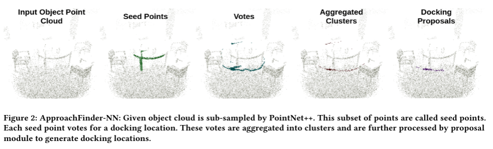
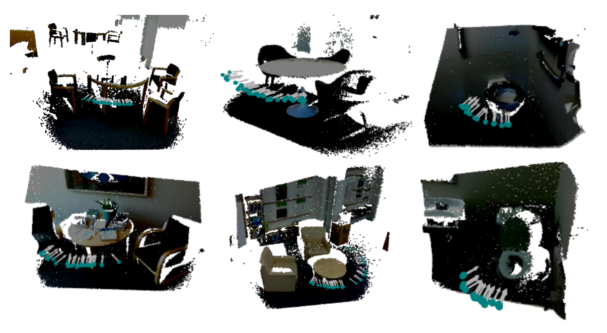

# ApproachFinder-NN
A real-time computer vision algorithm to find potential docking locations indoor environments.

## Project Brief:
A smart wheelchair improves the quality of life for older adults by supporting their mobility independence. Some
critical maneuvering tasks, like table docking and doorway passage, can be challenging for older adults in wheelchairs,
especially those with additional impairment of cognition, perception or fine motor skills. Supporting such functions in
a shared manner with robot control seems to be an ideal solution. Considering this, we propose to augment smart
wheelchair perception with the capability to identify potential docking locations in indoor scenes.

[ApproachFinder-CV](https://github.com/ShivamThukral/ApproachFinder-CV) is a computer vision pipeline that detects safe docking poses and estimates their desirability weight based on
hand-selected geometric relationships and visibility. Although robust, this pipeline is computationally intensive. We
leverage this vision pipeline to generate ground truth labels used to train an end-to-end differentiable neural net that
is 15x faster. 

[ApproachFinder-NN](https://github.com/ShivamThukral/ApproachFinder-NN) is a point-based method that draws motivation from Hough voting and uses deep point
cloud features to vote for potential docking locations. Both approaches rely on just geometric information, making them
invariant to image distortions. A large-scale indoor object detection dataset, SUN RGB-D, is used to design, train and
evaluate the two pipelines.



Potential docking locations are encoded as a 3D temporal desirability cost map that can be integrated into any real-time
path planner. As a proof of concept, we use a model predictive controller that consumes this 3D costmap with efficiently
designed task-driven cost functions to share human intent. This [wheelchair navigation](https://github.com/ShivamThukral/Wheelchair-Navigation) controller outputs a nominal path that is safe,
goal-oriented and jerk-free for wheelchair navigation.

## Installation Instructions:
Please follow the installation instructions mentioned [here](https://github.com/ShivamThukral/ApproachFinder-CV#installation-instructions) to run the ApproachFinder-CV pipeline. Apart from this, you will have to install the following packages to run ApproachFInder-NN:
- Install [MATLAB](https://www.mathworks.com/help/install/) extract SUN RGB-D dataset. 
- Install python 3.8. It's recommended that you use [Anaconda](https://www.anaconda.com/products/individual) for your installations.
- Install [Pytorch](https://pytorch.org/)
    - `conda install pytorch==1.4.0 torchvision==0.5.0 cudatoolkit=10.1 -c pytorch`
- Install [Tensorflow](https://github.com/tensorflow/tensorflow) for [TensorBoard](https://www.tensorflow.org/tensorboard)
    - `conda install tensorflow`

This code is compatible with Pytorch v1.4, CUDA 10.1 and TensorFlow v2.x 

Install the following Python dependencies (with `pip install`):
```asm
matplotlib
opencv-python
plyfile
'trimesh>=2.35.39,<2.35.40'
'networkx>=2.2,<2.3'
Pillow
```
Compile the CUDA layers for [PointNet++](http://arxiv.org/abs/1706.02413), which we used in the backbone network:

    cd pointnet2
    python setup.py install

To see if the compilation is successful, try to run `python models/backbone_module.py`, `python models/voting_module.py`, `python models/my_proposal_module.py` and  `python models/parknet.py` to see if a forward pass works.

## Demo
We ship the code with a pretrained model under *'demo_files/model/checkpoint.tar'*. We also ship some sample object point clouds for running this demo (refer *demo_files/sample*).
Run the following command for demo:
```python
python run_demo.py --model_dir demo_files/model/docknet
```
For more information about input use `-h` option. The demo uses a pre-trained model to detect potential docking locations from validation set of SUN RGB-D dataset. We visualise 3D results using open3D and dump relevant intermendiate results in the dump folder.

### Demo with scene point cloud:
Our network expects object point cloud for proposals. You can supply a scene point cloud and we will first apply Votenet to filter candidate objects and then use ApproachFinder-NN for docking proposals.
```python
python demo_scene.py --model_dir demo_files/model/docknet
```

For more information about inputs use `-h` option. The bounding box given by Votenet is marked in red.

## Training
**Dataset Preparation:** follow the instructions [here](ApproachFinderCV-SUNRGBD/README.md)

To train ApproachFinder-NN on SUN RGB-D data:
```python
python train.py --log_dir log_docknet
```
Use `-h` option to know more about training options. While training you can use TenserBoard to see loss curves by running `python -m tensorboard.main --logdir=<log_dir_name> --port=6006`
The model would be saved in the log directory with name *'checkpoint.tar'*.
## Evaluation
We evaluate our network on two criteria: 3D-bounding box tightness and desirability costmap. For further details about these mentrics please refer the paper.
```python
python eval.py --checkpoint_path log_docknet/checkpoint.tar --dump_dir eval_docknet
python eval_desirability.py --checkpoint_path log_docknet/checkpoint.tar --dump_dir eval_des_docknet
```
Example results will be dumped in the eval_docknet and eval_des_docknet folder. Please use `-h` option to learn more about evaluation options. 
The evaluation results are stored in log_eval.txt file for both the metrics. 

## Results on SUN RGB-D dataset
